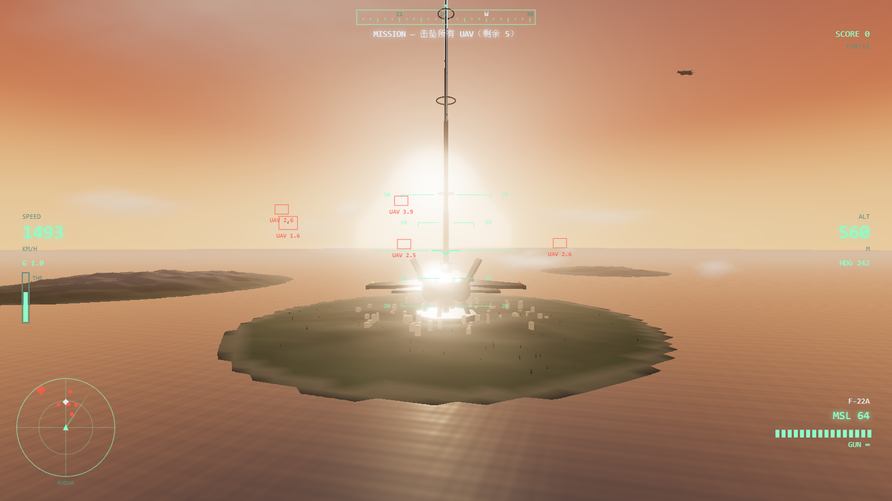
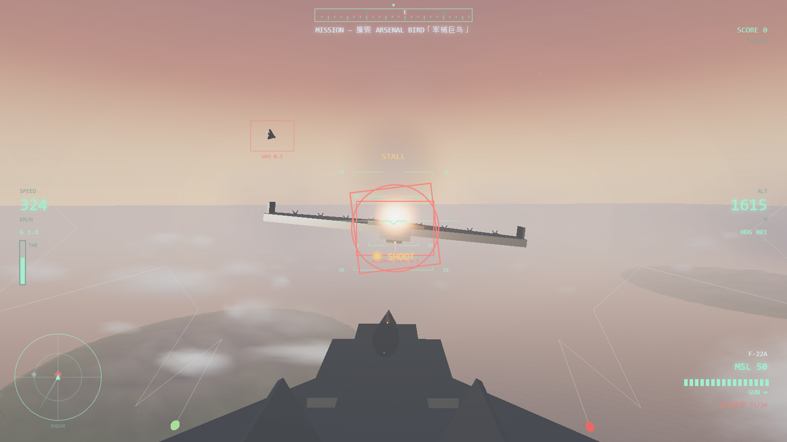
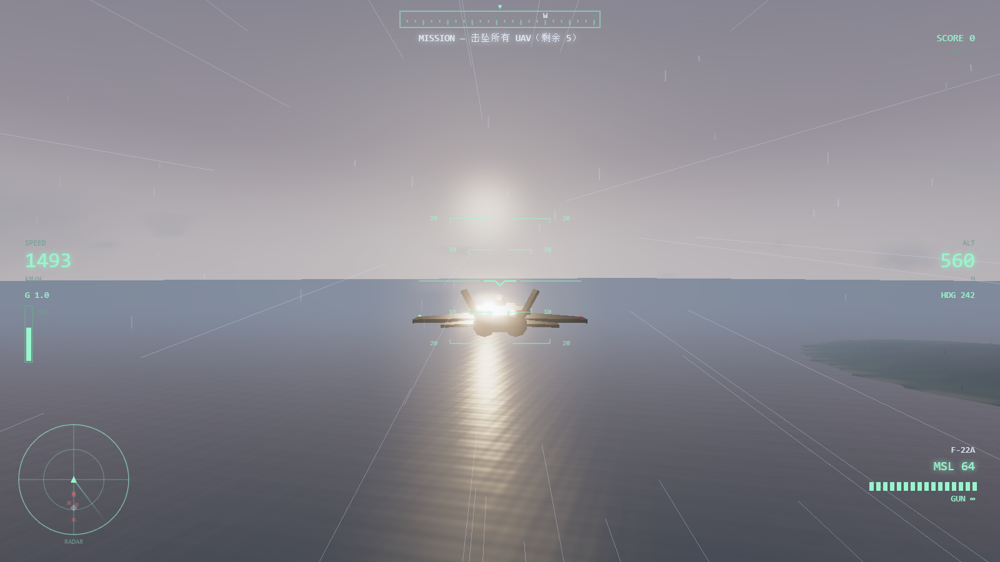

# ACE COMBAT 7 : SKIES UNKNOWN — Web Fan Tribute

皇牌空战 7 风格的网页空战游戏（Three.js，无外部素材，全部程序化生成）。

## 运行

- **双击 `启动游戏.bat`**（推荐），或
- 在本目录执行 `node serve.js`，然后浏览器打开 <http://localhost:8123>

> 注意：不能直接双击 `index.html`（ES Modules 在 `file://` 协议下被浏览器拦截，会导致按键无响应）。

## 操作

| 输入 | 功能 |
| --- | --- |
| **鼠标** | 指向（机头追随准星，自动压坡度协调转弯） |
| **Q / E** | 滚筒 |
| **A / D** | 平移（方向舵） |
| **W / S** | 节流阀（加 / 减推力） |
| **Shift** | 加力（AB） |
| **Ctrl** | 减速 |
| **左键** | 机炮 |
| **右键 / 空格** | 发射导弹（锁定后，出现 SHOOT 提示） |
| **F** | 机炮（键盘备用） |
| **V** | 切换近/远视角 |
| **1 ~ 4** | 手动切换天气（晴 / 多云 / 降雨 / 雷暴） |
| **P** | 暂停 |

标题界面提供「俯仰反转」选项（记忆设置）。

## 内容

- **三架可选战机**：F-16C / F-22A / Su-57，速度、机动、耐久、载弹各不相同
- **任务**：先击坠全部 MQ-101 无人机，随后 **军械巨鸟（Arsenal Bird）** 进入战场，击沉它即任务完成
- **宇宙电梯**：黄昏海面上的 Lighthouse，带灯柱、光环与防撞信标
- **动态天气**：晴 ↔ 多云 ↔ 降雨 ↔ 雷暴自动循环（也可按键手动切换）
- **体积云**：Raymarch 步进采样 3D 噪声云场（比尔透光 + 向阳阴影 + 粉末效应 + 蓝噪抖动），
  从疏云到雷暴乌云连续一体，可穿云（舱盖起雾、雨滴划过）、可在云顶俯瞰云海
- **雷暴**： procedurally 生成闪电、闪光、随距离延迟的雷声、海面变暗
- **完整 HUD**：速度/高度/过载/油门、姿态仪、罗盘带、扫描雷达、目标框与锁定环、
  导弹来袭/PULL UP/STALL 告警、击落播报、计分

## 技术要点

- Three.js r160（本地 `libs/`，可离线运行）+ UnrealBloom 后处理
- 飞行模型为街机式：协调转弯、失速、过载掉速、FOV 随速度扩张
- 导弹采用比例导引；无人机有巡逻/缠斗/规避蛇形 AI；巨鸟半血后加速释放无人机
- 音频全部由 WebAudio 合成（引擎、风、雨、锁定音、爆炸、雷声）
- **原创分层配乐**（皇牌空战式史诗交响风）：D 小调进行、弦乐固定音型、太鼓/定音鼓、
  铜管重音、英雄主题旋律；强度随战况递进（机库铺垫 → 无人机战加鼓 → 巨鸟战全编制主旋律）

## 调试 URL 参数

`?auto=f22` 跳过菜单直接出击 · `&weather=0~3` 初始天气 · `&ff=25` 快进 25 秒 ·
`&god=1` 无敌 · `&phase2=1` 直接进巨鸟阶段 · `&birdcam=1` 伴飞巨鸟并自动开火 · `&debug=1` 状态输出

