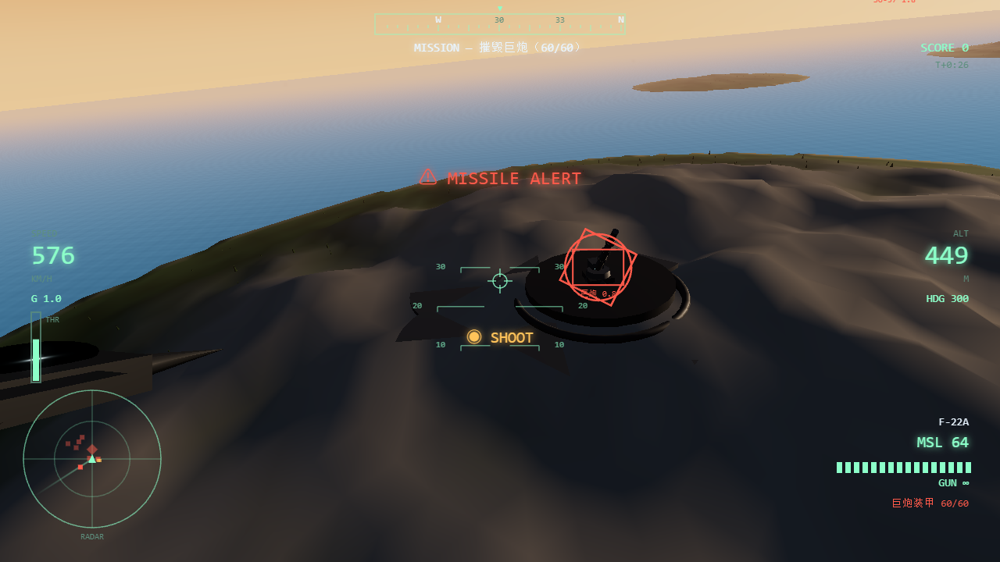
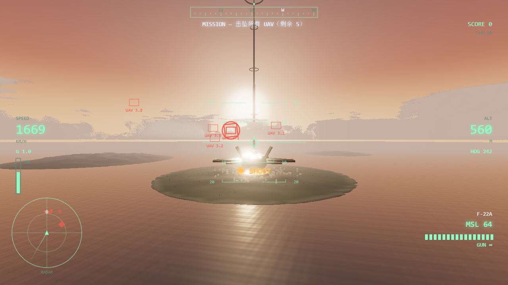
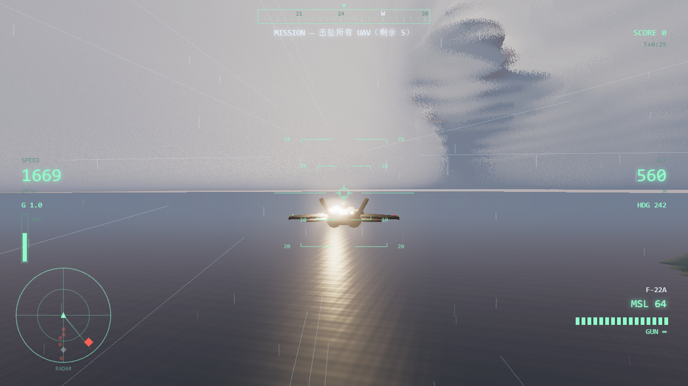

# ACE COMBAT 7 : SKIES UNKNOWN — Web Fan Tribute

皇牌空战 7 风格的网页空战游戏（Three.js，无外部素材，全部程序化生成）。

## 运行

- **双击 `启动游戏.bat`**（推荐），或
- 在本目录执行 `node serve.js`，然后浏览器打开 <http://localhost:8123>

> 注意：不能直接双击 `index.html`（ES Modules 在 `file://` 协议下被浏览器拦截，会导致按键无响应）。

## 操作

| 输入 | 功能 |
| --- | --- |
| **鼠标** | 指向（机头追随准星，自动压坡度协调转弯） |
| **Q / E** | 滚筒 |
| **A / D** | 平移（方向舵） |
| **W / S** | 节流阀（加 / 减推力） |
| **Shift** | 加力（AB） |
| **Ctrl** | 减速 |
| **左键** | 机炮 |
| **右键 / 空格** | 发射导弹（锁定后，出现 SHOOT 提示） |
| **F** | 机炮（键盘备用） |
| **V** | 视角循环：近距追逐 → 远距追逐 → **座舱（FOV 90）** |
| **1 ~ 4** | 手动切换天气（晴 / 多云 / 降雨 / 雷暴） |
| **P** | 暂停 |

标题界面提供「俯仰反转」选项（记忆设置）。

## 战役

- **MISSION 1 «LIGHTHOUSE»**：击坠两波 MQ-101 无人机 → **军械巨鸟（Arsenal Bird）** 携无人机会战 → 击沉巨鸟
- **MISSION 2 «CANNON»**：**沙漠军事基地**——压制环形部署的 4 处 **SAM 防空导弹设施** → **900m 超大地井盖门开启，375m 巨炮自地下电梯升起** →
  敌方战斗机大队围攻下的巨炮决战（己方**僚机**全程编队支援）。**我方巨鸟**在外围盘旋支援，巨炮会周期性充能**光束**狙击巨鸟——
  **在巨鸟被击坠前摧毁巨炮**（HUD 右侧同时显示巨炮装甲与巨鸟结构）。巨炮也会对玩家周期性充能齐射（看到「巨炮充能」警告立刻机动规避）。两关均可更换座机：F-16C / F-22A / Su-57。

## 画面技术

- **体积云（Horizon 式）**：云图（weather map）决定云的地理分布；64³ 3D 噪声纹理（Perlin-Worley 基形 + 三倍频 Worley 侵蚀）
  塑造一朵朵独立积云——平底圆顶、花椰菜边缘；半分辨率 Raymarch 步进采样 + **3×3 tent 去噪滤波**（消除抖动颗粒）合成，
  HG 双瓣**散射**相位、Beer-Lambert **透射**、3 点**自阴影**采样、多次散射补光、粉末效应；底部深灰蓝 → 顶部亮白的强环境渐变（积云立体感）；
  逐像素**深度截断**（飞机/地形正确遮挡云，云也能盖住飞机）；可穿云、可俯瞰云海
- **自适应画质**：帧时间看门狗持续超标时自动降低渲染像素比与云采样步数（防止低配机卡死）
- **地面云影**：海洋与地形着色器直接采样云图投影（2.5D 近似）
- **体积光**（God Rays）：向太阳屏幕位置的径向散射，深度图掩天空，从云隙中倾泻
- **碧蓝海水**：程序波浪法线 + 菲涅尔天光反射 + 太阳镜面光路
- 动态天气：晴 ↔ 多云 ↔ 降雨 ↔ 雷暴自动循环；雷暴含程序化闪电、全屏闪光、延迟雷声
- 黄昏 ACES 色调映射 + UnrealBloom；M1 宇宙电梯 Lighthouse + 岛屿城市；M2 沙漠基地（跑道/机库/雷达/围墙）
- 音频调度防卡：页面休眠后音乐调度直接对齐当前时间，不补积压节拍

## 音频

全部由 WebAudio 现场合成：引擎/风/雨/锁定音/爆炸/雷声，以及**原创分层配乐**（皇牌空战式史诗交响风）：
D 小调进行、弦乐固定音型、太鼓定音鼓、铜管重音、英雄主题——**强度随战况递进**
（机库铺垫 → 缠斗加鼓 → 巨鸟/巨炮决战全编制高八度主旋律 + 双踩）。

## 调试 URL 参数

`?auto=f22` 直接出击 · `&m=2` 第二关 · `&weather=0~3` 天气 · `&ff=25` 快进 · `&god=1` 无敌 ·
`&cam=2` 座舱 · `&phase2=1` 巨鸟阶段 · `&silo=1` 巨炮阶段环绕镜头 · `&birdcam=1` 伴飞巨鸟 · `&debug=1` 状态输出

